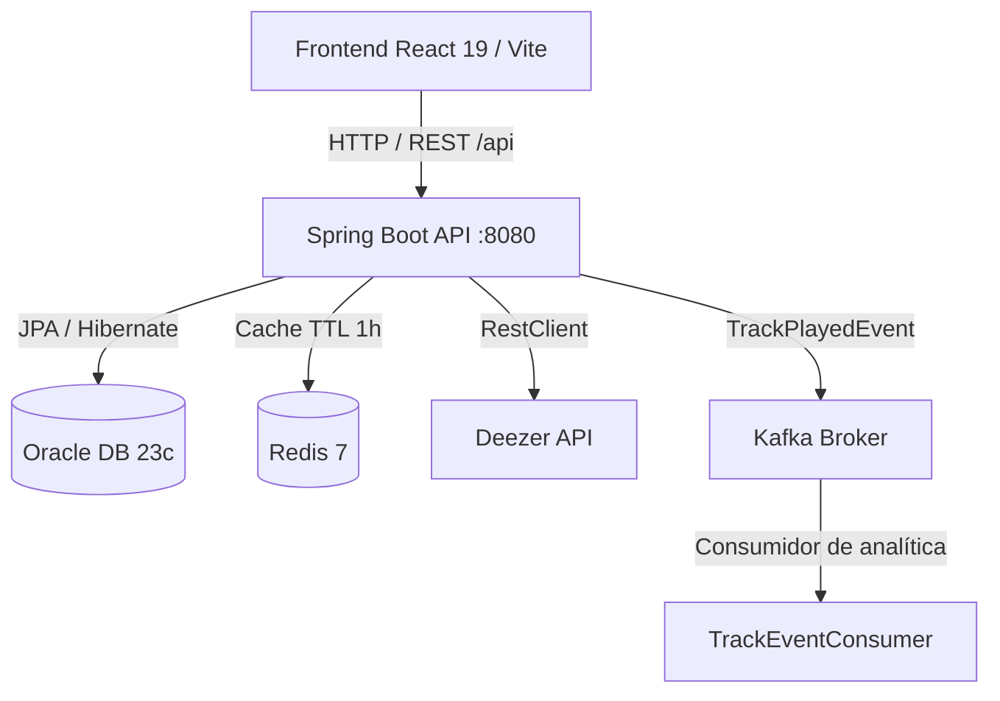

Clon funcional de Spotify construido con una arquitectura de **microservicios orientada a eventos**: el backend en Spring Boot sirve una API REST que consulta el catálogo de Deezer, cachea respuestas en Redis y emite métricas de reproducción hacia Kafka; el frontend en React ofrece una interfaz editorial en blanco y negro con tema claro/oscuro.

[](https://github.com/bulletformyvalentinefan/play-something/actions/workflows/ci-build.yml)


---

## Arquitectura del Sistema



El flujo de reproducción es **asíncrono**: el frontend solicita el track, el backend devuelve la URL de preview y, en paralelo, publica un `TrackPlayedEvent` en el tópico `track-played-topic` que un consumidor procesa para analítica sin bloquear la respuesta.

---

## Stack Tecnológico

| Capa | Tecnología |
| --- | --- |
| **Frontend** | React 19, Vite 8, React Router 7, pnpm, JavaScript (oxlint) |
| **Backend Java (legacy)** | Java 21, Spring Boot 3.4.3 (Web, Data JPA, Validation), Lombok |
| **Backend Go (proxy Spotify)** | Go 1.26, chi, go-librespot v0.9.1 (ingeniería inversa), AES-GCM |
| **Base de Datos** | Oracle Database 23c Free (JDBC thin) |
| **Caché** | Redis 7 — TTL de 1 hora e invalidación declarativa (`@Cacheable`, `@CacheEvict`) |
| **Mensajería / Streaming** | Apache Kafka 7.6 (modo KRaft) |
| **Cliente externo** | Spotify (vía go-librespot spclient/login5 + api.spotify.com) / Deezer (legacy) |
| **Contenedores** | Docker Compose (Oracle, Redis, Kafka, spotify-proxy :8081) |
| **CI/CD** | GitHub Actions (Maven + pnpm + Go) |

---

## Estructura del Repositorio

```text
.
├── src/main/java/…              # Backend Spring Boot (legado, dominios: user, track, playlist)
├── src/main/resources/          # application.yml
├── spotify-proxy/               # Go service go-librespot (ing. inversa): auth redirect, proxy api.spotify.com, player
│   ├── cmd/server/              # entrypoint :8081
│   └── internal/{config,crypto,store,auth,handler,spotify}
├── frontend/                    # React 19 + Vite + pnpm
├── docker-compose.yml           # Oracle, Redis, Kafka, spotify-proxy
└── .github/workflows/           # CI (Java + Go + pnpm)
```

---

## Puesta en Marcha Local

### 1. Requisitos Previos

- **Docker** y **Docker Compose** instalados.
- **JDK 21+** instalado (para backend legado).
- **Go 1.26+** instalado (para spotify-proxy).
- **Node.js v20+** y **pnpm 9+** instalados (`npm i -g pnpm`).

### 2. Clonar el Repositorio

```bash
git clone https://github.com/bulletformyvalentinefan/play-something.git
cd play-something
```

### 3. Levantar la Infraestructura (Oracle, Redis y Kafka)

```bash
docker compose up -d
```

Se levantan tres servicios en segundo plano:

| Servicio | Imagen | Puerto |
| --- | --- | --- |
| Oracle DB | `gvenzl/oracle-free:23-slim` | `1521` |
| Redis | `redis:7-alpine` | `6379` |
| Kafka | `confluentinc/cp-kafka:7.6.0` | `9092` |

> La configuración de arranque del backend vive en `src/main/resources/application.yml`, con credenciales por defecto que coinciden con el `docker-compose.yml` (base `FREEPDB1`, usuario `spotify_user`). No es necesario crear archivos `.env` para un arranque local.

### 4. Ejecutar el Backend

```bash
# Linux / macOS
./mvnw spring-boot:run

# Windows
mvnw.cmd spring-boot:run
```

El backend quedará expuesto en **http://localhost:8080** con base de rutas `/api/v1/spotify`.

### 5. Ejecutar el Proxy Go (Spotify)

```bash
cd spotify-proxy
go run ./cmd/server
# requiere CREDENTIAL_KEY=32bytes, ver internal/config/config.go
# en Linux con CGO para audio: CGO_ENABLED=1 go run ./cmd/server
```

Queda en **http://localhost:8081**. Endpoints: `/api/v1/spotify/auth/start`, `/auth/callback`, `/proxy/me`, `/proxy/search`, `/player/*`.

### 6. Ejecutar el Frontend

```bash
cd frontend
pnpm install
pnpm dev
```

El frontend quedará accesible en **http://localhost:5173**. Vite proxea `/api/v1/spotify/auth|proxy|player` → `spotify-proxy:8081` y el resto de `/api` → `Spring:8080`.

---

## Endpoints Principales (Contratos de API)

Base: `/api/v1/spotify` · Formato de respuesta: JSON · Errores: `400` validación, `404` no encontrado.

| Método | Ruta | Descripción | Caché / Asíncrono |
| --- | --- | --- | --- |
| `POST` | `/auth/register` | Registrar un usuario | — |
| `POST` | `/auth/login` | Iniciar sesión | — |
| `GET` | `/user/{id}` | Obtener un usuario | — |
| `GET` | `/tracks/search?q={query}` | Buscar tracks en el catálogo de Deezer | Redis (`@Cacheable` `track_searches`) |
| `GET` | `/tracks/{trackId}` | Detalle de un track | Redis (`@Cacheable` `tracks`) |
| `POST` | `/tracks/{trackId}/play?userId={userId}` | Obtener el audio y emitir la métrica de reproducción | Kafka (`track-played-topic`) |
| `POST` | `/playlists` | Crear una playlist | Redis (`@CachePut` / `@CacheEvict`) |
| `GET` | `/users/{userId}/playlists` | Listar playlists de un usuario | Redis (`@Cacheable` `user_playlists`) |
| `GET` | `/playlists/{playlistId}` | Detalle de una playlist | Redis (`@Cacheable` `playlist`) |
| `POST` | `/playlists/{playlistId}/tracks` | Añadir un track a la playlist | Redis (invalidación) |
| `DELETE` | `/playlists/{playlistId}/tracks/{trackId}` | Quitar un track de la playlist | Redis (invalidación) |
| `DELETE` | `/playlists/{playlistId}` | Eliminar una playlist | Redis (invalidación) |

**Ejemplo — crear una playlist:**

```bash
curl -X POST http://localhost:8080/api/v1/spotify/playlists \
  -H "Content-Type: application/json" \
  -d '{"userId":"<uuid>","titulo":"Mi playlist","descripcion":"favoritas","esPublica":true}'
```

**Ejemplo — registrar un usuario:**

```bash
curl -X POST http://localhost:8080/api/v1/spotify/auth/register \
  -H "Content-Type: application/json" \
  -d '{"nombre":"Ana","email":"ana@mail.com"}'
```

> No hay Swagger/OpenAPI habilitado actualmente; los contratos se documentan en esta tabla.

---

## Caché y Eventos

### Caché (Redis)

| Caché | Clave | TTL | Uso |
| --- | --- | --- | --- |
| `track_searches` | query | 1 h | Respuestas de búsqueda de tracks |
| `tracks` | trackId | 1 h | Detalle individual de tracks |
| `playlist` | playlistId | 1 h | Detalle de playlists |
| `user_playlists` | userId | 1 h | Listado de playlists por usuario |

Las escrituras invalidan las entradas afectadas mediante `@CachePut`/`@CacheEvict` para mantener consistencia (por ejemplo, añadir/quitar tracks o eliminar una playlist limpia `playlist` y `user_playlists`).

### Eventos (Kafka)

- **Tópico:** `track-played-topic`
- **Productor:** `TrackEventProducer` — emite `TrackPlayedEvent` (`trackId`, `userId`, `playedAt`) al reproducir un track.
- **Consumidor:** `TrackEventConsumer` — procesa la analítica de reproducción sin afectar la latencia de la API.


